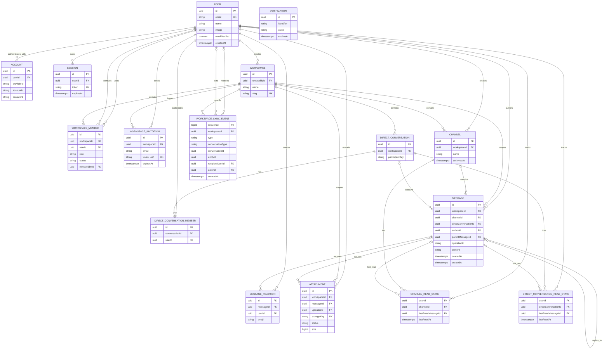

# Relay — Domain & Data Model

## 1. Main Entities

### User
Fields:

- id
- email
- name
- image
- emailVerified
- createdAt
- updatedAt

Better Auth owns the compatible core user record. Relay domain records reference the same user ID.

### Account
- id
- userId
- providerId
- accountId
- password nullable
- accessToken nullable
- refreshToken nullable
- accessTokenExpiresAt nullable
- refreshTokenExpiresAt nullable
- scope nullable
- idToken nullable
- createdAt
- updatedAt

Relay uses this table for email/password credentials. OAuth provider data is reserved for possible future work.

Unique constraint: `(providerId, accountId)`. The `password` field contains a password hash, never plaintext.

### Session
- id
- userId
- token
- expiresAt
- ipAddress nullable
- userAgent nullable
- createdAt
- updatedAt

Session tokens are unique. Sessions are opaque and database-backed.

### Verification
- id
- identifier
- value
- expiresAt
- createdAt
- updatedAt

This table is reserved for future one-time verification workflows.

### Workspace
- id
- name
- slug
- imageUrl
- createdById
- createdAt
- updatedAt

Ownership is represented only by the workspace's active `WorkspaceMember` with role `OWNER`; `Workspace` does not duplicate an `ownerId` source of truth.

### WorkspaceMember
- id
- workspaceId
- userId
- role: OWNER | ADMIN | MEMBER
- joinedAt
- status: ACTIVE | REMOVED
- removedAt nullable
- removedById nullable

Unique constraint: `(workspaceId, userId)`.

Each workspace must have exactly one active `OWNER`. Enforce this with a PostgreSQL partial unique index on `workspaceId` where role is `OWNER` and status is `ACTIVE`, plus transactional service rules that prevent removing or demoting the current Owner.

Workspace creation atomically inserts the workspace and its Owner membership. V1 role changes cannot assign `OWNER`.

### WorkspaceInvitation
- id
- workspaceId
- email
- role
- tokenHash
- invitedById
- expiresAt
- acceptedAt
- revokedAt
- createdAt

`acceptedAt` and `revokedAt` are mutually exclusive. Acceptance uses a transaction with a row lock or conditional update so only one concurrent request can consume the invitation.

### Channel
- id
- workspaceId
- name
- description
- createdById
- archivedAt
- createdAt
- updatedAt

### DirectConversation
- id
- workspaceId
- participantKey
- createdAt
- updatedAt

Unique constraint: `(workspaceId, participantKey)`. The service builds `participantKey` from the two sorted user IDs so concurrent find-or-create operations resolve to one conversation.

### DirectConversationMember
- id
- conversationId
- userId

For V1 one-to-one DMs, enforce exactly two members at the service layer.

Unique constraint: `(conversationId, userId)` so both participants are distinct rows.

### Message
- id
- workspaceId
- channelId nullable
- directConversationId nullable
- authorId
- operationId
- parentMessageId nullable
- content
- editedAt nullable
- deletedAt nullable
- createdAt
- updatedAt

Constraint: a message belongs to exactly one conversation type.

Unique constraint: `(authorId, operationId)` for durable send idempotency.

### MessageReaction
- id
- messageId
- userId
- emoji
- createdAt

Unique constraint: `(messageId, userId, emoji)`.

### Attachment
- id
- workspaceId
- messageId nullable
- uploaderId
- fileName
- mimeType
- size
- storageKey
- status: PENDING | ATTACHED
- expiresAt nullable
- createdAt

Pending uploads are scoped to their uploader and workspace. They become attached only when the message transaction succeeds; unattached uploads expire after 24 hours.

Database checks enforce `PENDING` with a null `messageId` and `ATTACHED` with a non-null `messageId`. The only allowed transition is `PENDING` to `ATTACHED`, performed once in the message-creation transaction.

### ChannelReadState
- userId
- channelId
- lastReadMessageId nullable
- lastReadAt

Unique constraint: `(userId, channelId)`.

Updates are monotonic by the referenced message's canonical `(createdAt, id)` order.

### DirectConversationReadState
- userId
- directConversationId
- lastReadMessageId nullable
- lastReadAt

Unique constraint: `(userId, directConversationId)`.

Updates are monotonic by the referenced message's canonical `(createdAt, id)` order.

Separate read-state tables avoid nullable polymorphic foreign keys and make the one-state-per-user-and-conversation constraint explicit.

A durable Notification table is deferred until mentions or another committed notification behavior requires it.

### WorkspaceSyncEvent
- sequence: bigint primary key
- workspaceId
- type
- conversationType nullable
- conversationId nullable
- entityId nullable
- recipientUserId nullable
- actorId nullable
- createdAt

Client-visible durable mutations append a sync event in the same database transaction as the domain change. Coverage includes workspace, channel, DM, membership, invitation, message, reaction, and read-state changes. Events contain routing and entity metadata rather than treating a copied payload as domain truth. The synchronization service authorizes each event and hydrates canonical DTOs from current domain records. Presence and typing never enter this table.

## 2. Ephemeral Redis Data

Redis should store short-lived state rather than durable business history.

Examples:

```text
presence:user:{userId}
typing:channel:{channelId}
typing:dm:{conversationId}
socket:user:{userId}
```

Exact structures may evolve.

## 3. Key Relationships

```text
User
 ├── Account
 ├── Session
 ├── WorkspaceMember -> Workspace
 ├── Message
 ├── MessageReaction
 ├── ChannelReadState
 └── DirectConversationReadState

Workspace
 ├── WorkspaceMember
 ├── Channel
 ├── DirectConversation
 ├── WorkspaceInvitation
 ├── Message
 └── WorkspaceSyncEvent

Channel
 └── Message

DirectConversation
 ├── DirectConversationMember
 └── Message

Message
 ├── MessageReaction
 ├── Attachment
 └── parentMessage -> Message
```

## 4. Entity Relationship Diagram



## 5. Required Constraints and Indexes

Required constraints and indexes include:

- workspace membership lookups;
- unique `(workspaceId, userId)` membership;
- one active Owner per workspace through a partial unique index and transactional guards;
- unique `(providerId, accountId)` authentication account;
- case-insensitive unique channel name per workspace, including archived channels;
- unique `(workspaceId, participantKey)` direct conversation;
- unique `(conversationId, userId)` direct conversation member;
- messages by channel and `(createdAt, id)`;
- messages by direct conversation and `(createdAt, id)`;
- unique `(authorId, operationId)` message send;
- reactions by message;
- unique `(messageId, userId, emoji)` reaction;
- unique read state by user and channel or DM;
- invitations by token hash / email;
- a check that invitation `acceptedAt` and `revokedAt` are not both set;
- pending attachments by expiry;
- a check matching attachment status to null/non-null `messageId`;
- workspace sync events by `(workspaceId, sequence)` and recipient where applicable;
- a PostgreSQL GIN full-text search index over non-deleted message content.

Database checks or equivalent transactionally enforced service rules must ensure that a message has exactly one conversation target and that reply, attachment, and read-state references remain in the same workspace and conversation.

## 6. Storage Conventions

- Durable IDs are UUIDs.
- Timestamps are UTC `timestamptz` values.
- API timestamps are ISO 8601 UTC strings.
- Message deletion clears content and retains the row as a tombstone.
- Attachment URLs are resolved by an authorized API endpoint and are not stored as public durable URLs.

## 7. Data Isolation

Workspace ID should be carried through workspace-owned records where it improves authorization and query safety, even if it is technically derivable through a relation.
